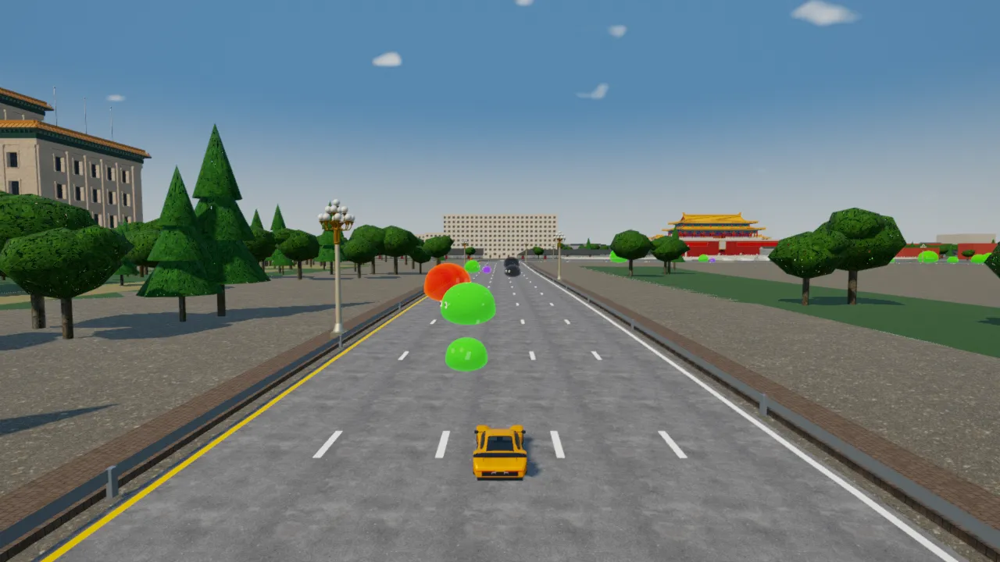
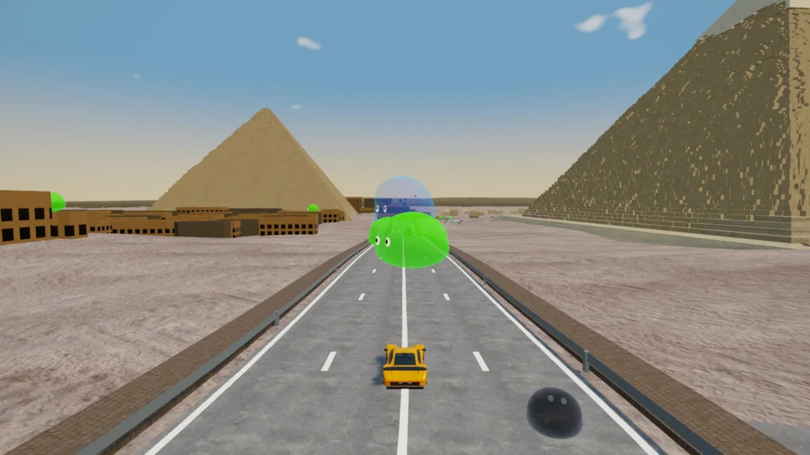
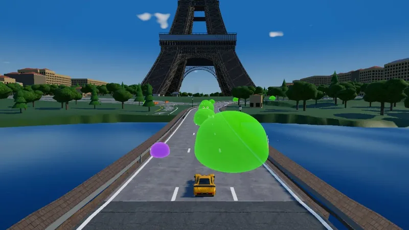
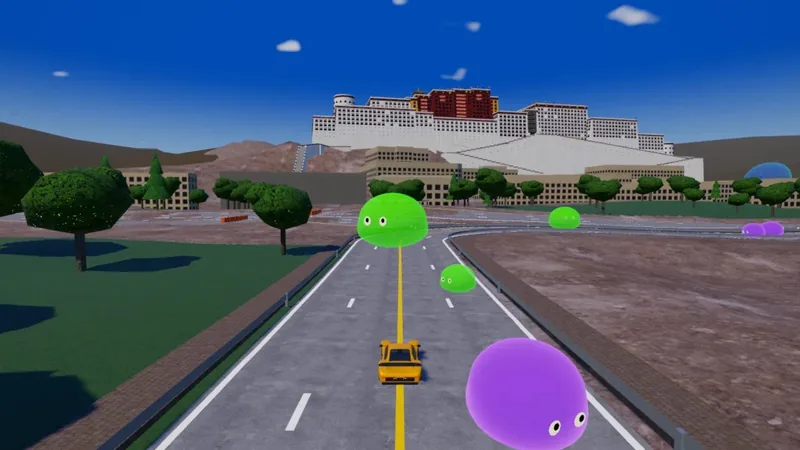
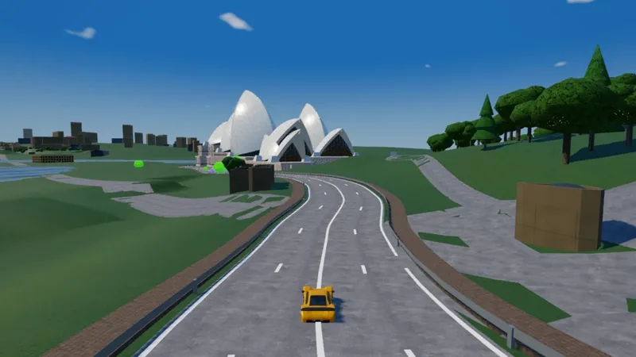
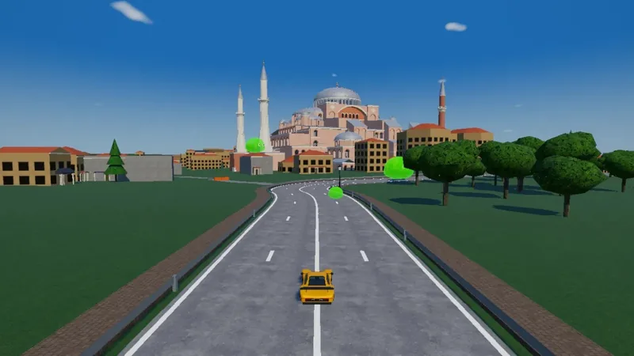
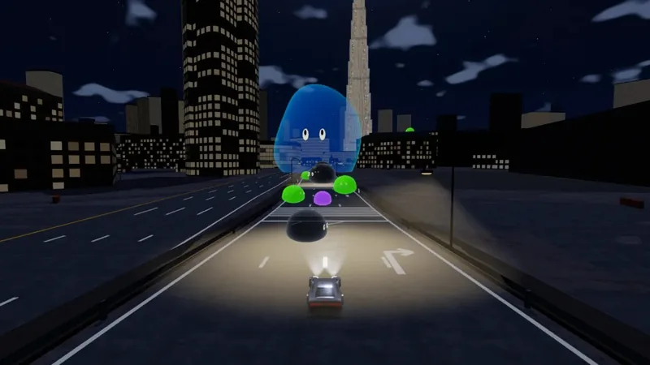
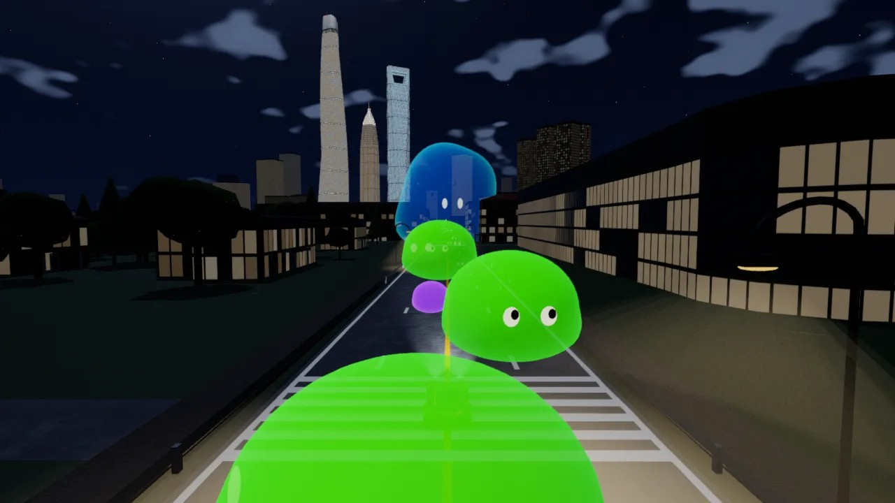

<h1 align="center">Make your own racing game with AI</h1>
<h1 align="center">用 AI 做你自己的赛车游戏</h1>

<p align="center"><b>Your city. Your terrain. Your cars. Your game.</b><br>Fork this codebase and let the Remix Skill guide your AI agent.</p>

<p align="center"><a href="skills/remix/SKILL.md"><b>🛠 Start with the Remix Skill · 开始做自己的游戏 →</b></a></p>

<p align="center">
  <a href="https://guigulaoshi.itch.io/silicon-slime-rush"></a>
  <a href="https://guigulaoshi.itch.io/silicon-slime-rush-world-tour"></a>
</p>
<p align="center"><a href="https://guigulaoshi.itch.io/silicon-slime-rush">▶ Silicon Valley · 硅谷试玩</a> · <a href="https://guigulaoshi.itch.io/silicon-slime-rush-world-tour">▶ World Tour · 环游世界试玩</a><br>Play in your browser on desktop, phone or tablet · 点击即玩，支持电脑、手机和平板</p>

<table>
  <tr>
    <td width="33%" align="center"><br><b>Tiananmen Square</b><br>天安门广场</td>
    <td width="33%" align="center"><br><b>Pyramids of Giza</b><br>吉萨金字塔</td>
    <td width="33%" align="center"><br><b>Eiffel Tower</b><br>埃菲尔铁塔</td>
  </tr>
  <tr>
    <td width="33%" align="center"><br><b>Golden Gate Bridge</b><br>金门大桥</td>
    <td width="33%" align="center"><br><b>Potala Palace</b><br>布达拉宫</td>
    <td width="33%" align="center"><br><b>Sydney Opera House</b><br>悉尼歌剧院</td>
  </tr>
  <tr>
    <td width="33%" align="center"><br><b>Hagia Sophia</b><br>圣索菲亚大教堂</td>
    <td width="33%" align="center"><br><b>Burj Khalifa</b><br>哈利法塔</td>
    <td width="33%" align="center"><br><b>Lujiazui, Shanghai</b><br>上海陆家嘴</td>
  </tr>
</table>

## Make it yours

Turn your hometown, school, mountain roads or coastline into a racing game. Choose the terrain, landmarks, cars, style and rules. The **[Remix Skill](skills/remix/SKILL.md)** helps your AI coding agent copy the game, ask what you want, build it and test a playable version. Make as many independent games as you like.

**Fork or clone this repository, open it in your coding agent, and paste:**

```text
Read skills/remix/SKILL.md and make my own racing game.
Copy original/ into a new folder named my-racing-game/.
I want coastal roads in my hometown, local landmarks,
small rally cars and a sunset atmosphere.
Ask me about the places and gameplay, then build and test
a playable local version. Ask before publishing.
```

Replace the example with your idea. Real roads and elevation data give you a starting point; the code is yours to customize.

用 [Remix Skill](skills/remix/SKILL.md) 把原作复制成独立游戏，换成你的家乡、学校、山路或海岸，自己定地形、地标、车、美术和玩法。把仓库交给编程 Agent，让它读这个技能，先问清你的想法，再实现并测试。可以从同一套代码做出多个不同的游戏。

## Two examples, one starting point

| Game | What you can play | Screenshots, source & setup |
|---|---|---|
| **[▶ Silicon Valley](https://guigulaoshi.itch.io/silicon-slime-rush)** | Eight Bay Area tracks, nine cars · 八条湾区赛道、九辆车 | [original/](original/README.md) |
| **[▶ World Tour](https://guigulaoshi.itch.io/silicon-slime-rush-world-tour)** | A full remix across thirteen destinations · 十三个目的地的完整改编作品 | [world-tour/](world-tour/README.md) |

Code: [MIT](LICENSE) — copy, modify and make your own games. Keep the license notice and respect the separate [map and asset licenses](original/ASSETS.md) ([World Tour assets](world-tour/ASSETS.md)).

By [guigulaoshi](https://github.com/guigulaoshi) · [More games](https://guigulaoshi.itch.io)
