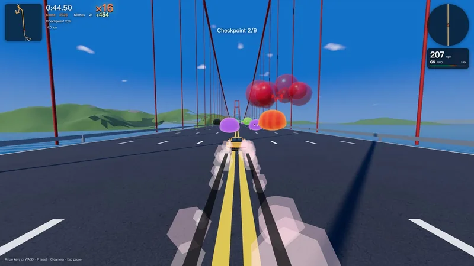
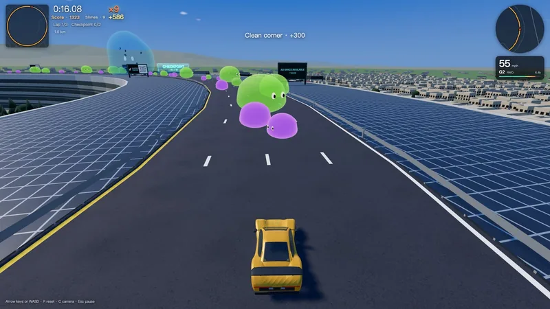
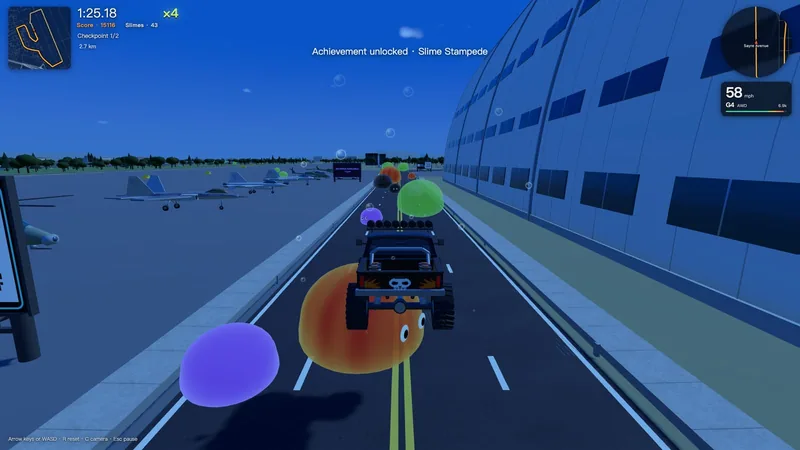
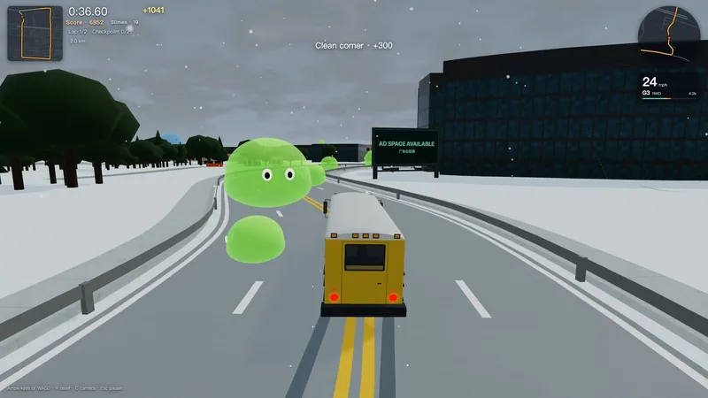

# Silicon Slime Rush: Silicon Valley

[中文](#中文) · [Make your own game with the Remix Skill](../skills/remix/SKILL.md)

Browser racing on real Bay Area roads. Too much silicon piled up in Silicon Valley. It woke up, turned into slimes, and seeped onto the roads. The roads, terrain and buildings come from open map data; everything else is made up.

Eight Bay Area tracks with forward and reverse routes, nine cars, five slime types, day and night, rain, fog and snow. Race solo or in desktop split-screen, earn track ratings, and chase your best time with a ghost car.

<p>
  <a href="https://guigulaoshi.github.io/silicon-slime-rush/"></a>
  <a href="https://guigulaoshi.itch.io/silicon-slime-rush"></a>
</p>

Desktop, phone and tablet

Want your own setting, terrain and cars? Start with the **[Remix Skill](../skills/remix/SKILL.md)** and use this game as inspiration.

## Screenshots

<table>
  <tr>
    <td></td>
    <td></td>
  </tr>
  <tr>
    <td align="center">Golden Gate Bridge · 金门大桥</td>
    <td align="center">Across a campus roof · 开上园区的屋顶</td>
  </tr>
  <tr>
    <td></td>
    <td></td>
  </tr>
  <tr>
    <td align="center">Hangar One, Moffett Field · 莫菲特机场一号机库</td>
    <td align="center">Snow in the Bay · 湾区下雪了</td>
  </tr>
</table>

## Layout

| Path | Contents |
|---|---|
| `game/` | Browser game: TypeScript, Three.js, Rapier physics and Vite |
| `pipeline/` | Python 3.12 map pipeline: OpenStreetMap and elevation data to streaming tiles; cached source data and route definitions |
| `assets-src/` | Blender Python sources for cars and landmarks; ready-to-use models are in `game/public/models/` |
| `tools/` | Map asset checks, size checks and release packaging |
| `docs/` | [Pipeline/runtime contract](docs/CONTRACT.md) and vehicle/landmark references |
| [ASSETS.md](ASSETS.md) | Asset sources, licenses and attribution |

## Run locally

From this game's directory (`original/`):

```bash
cd pipeline
python3.12 -m venv .venv
.venv/bin/pip install -r requirements.txt
cd ../game
npm install
npm run dev
```

Open the local URL printed by Vite. Map tiles and textures are build products: `npm run dev`, `preview` and `build` ensure they are ready automatically. The first run builds every track; later runs rebuild only what changed. Ground textures may be downloaded from Poly Haven (CC0) on first use.

## Tests

Run each command from this game's directory:

```bash
(cd game && npm run typecheck && npm test)
(cd pipeline && .venv/bin/python -m pytest -q)
pipeline/.venv/bin/python -m pytest -q tools
(cd game && npx playwright install chromium && npm run e2e:quick)
```

## Package a release

From this game's directory:

```bash
python3 tools/release_package.py
```

This builds for the release URL, excludes synthetic test tracks, checks package size and release readiness, and creates a ZIP with `index.html` at its root. Follow the upload instructions printed by the tool.

## 中文

### 史莱姆赛车：硅谷

浏览器里的末世赛车：硅谷堆了太多硅，硅活了，化成史莱姆渗到路上。道路、地形和建筑来自真实公开地图数据，其余都是编的。

八条湾区赛道，正反向都能跑；九辆车、五种史莱姆、昼夜晴雨雾雪、单人和桌面双人分屏，还有赛道评级、最好成绩和幽灵车。

**[在线试玩](https://guigulaoshi.github.io/silicon-slime-rush/)** · **[▶ itch.io 试玩](https://guigulaoshi.itch.io/silicon-slime-rush)**。想做自己的城市、地形和赛车，直接从 [Remix Skill](../skills/remix/SKILL.md) 开始。

### 本地运行、测试与出包

在 `original/` 目录按照上方英文部分的命令运行。先装地图管线的 Python 3.12 依赖，再进入 `game/` 安装依赖并启动。首次会构建赛道切片，并按需下载地面贴图；以后只重建有变化的部分。

上方测试命令分别检查类型与游戏逻辑、地图管线、工具脚本及浏览器运行。出包命令生成根目录带 `index.html` 的 ZIP，并打印上传说明。

目录说明：`game/` 是游戏，`pipeline/` 是地图管线，`assets-src/` 是车辆和地标源文件，`tools/` 是检查和打包脚本，`docs/` 是接口及参考资料。资源出处和许可见 [ASSETS.md](ASSETS.md)。

## Credits & license

Code: [MIT](../LICENSE). Map data © OpenStreetMap contributors (ODbL). Elevation: Mapzen/AWS Terrain Tiles. Other assets and attribution: [ASSETS.md](ASSETS.md).

代码采用 MIT 许可；地图数据采用 ODbL，高程来自 Mapzen/AWS Terrain Tiles，其他资源许可见资源清单。
