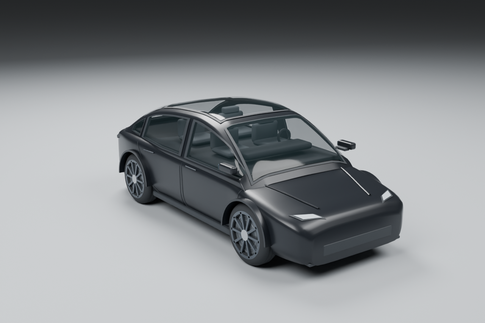
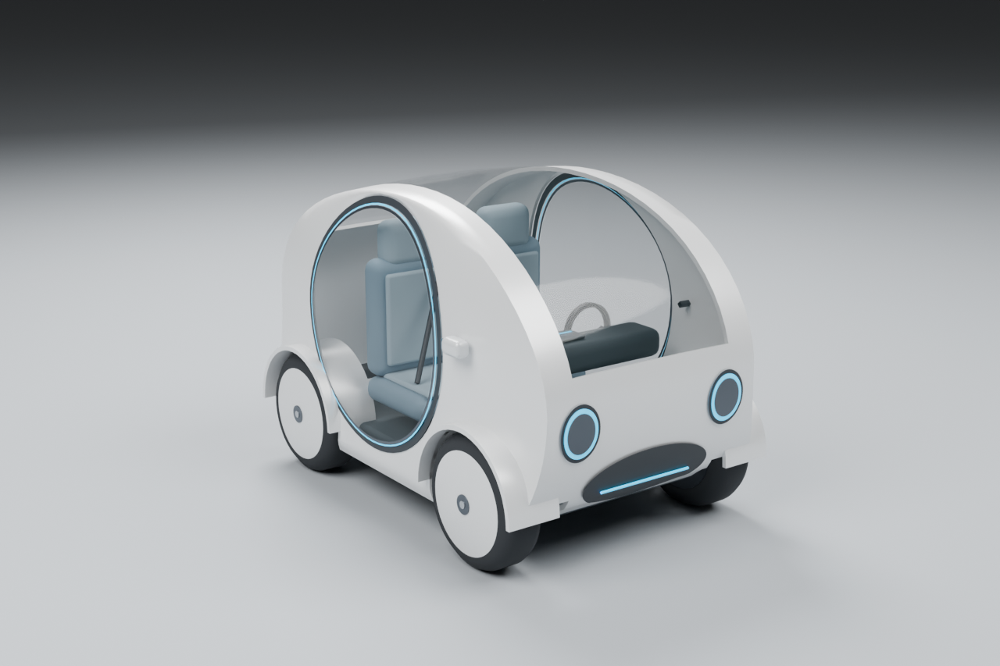
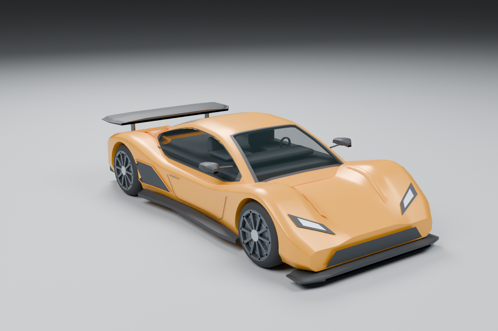
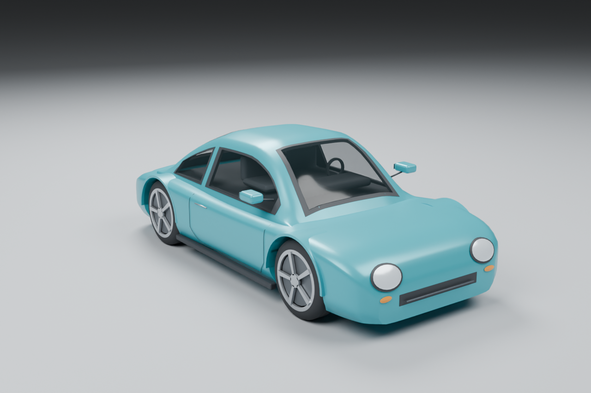
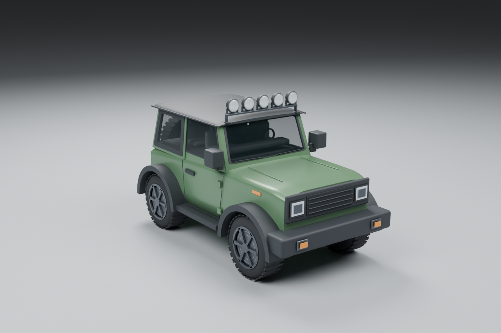
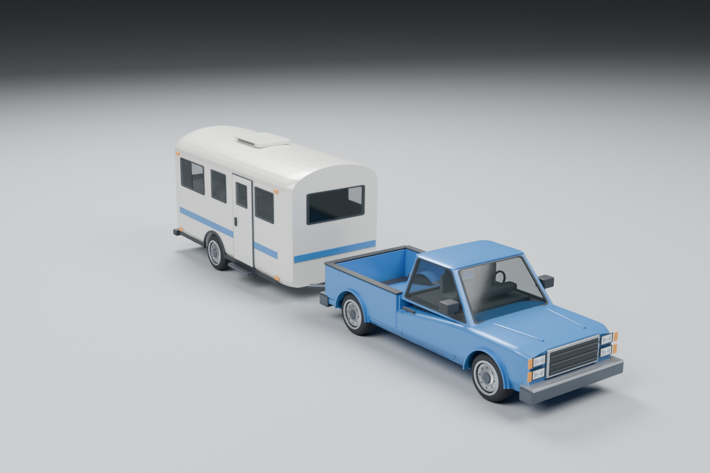
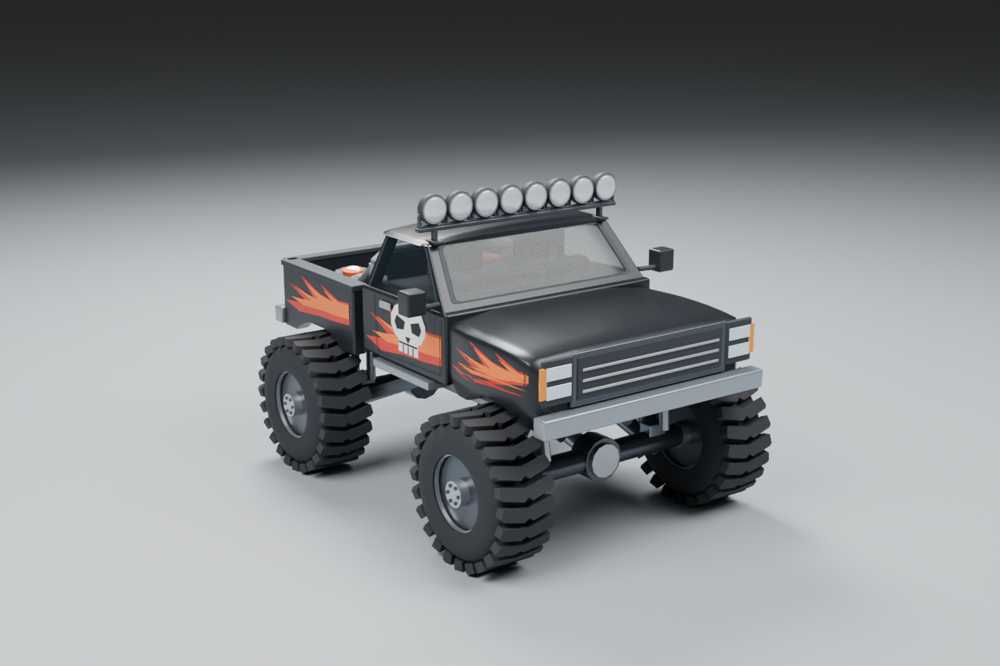
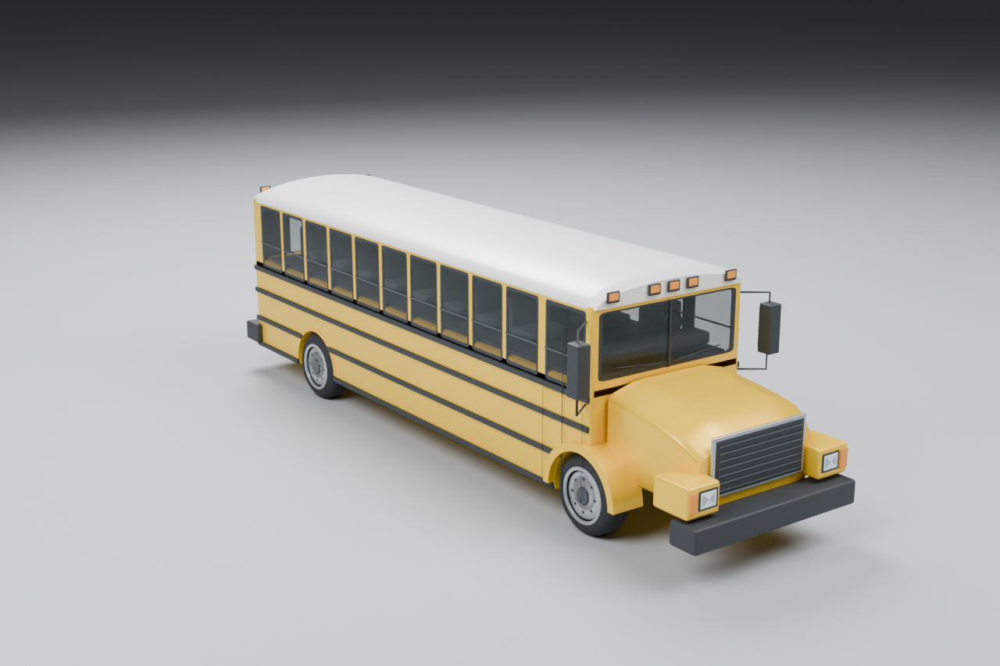
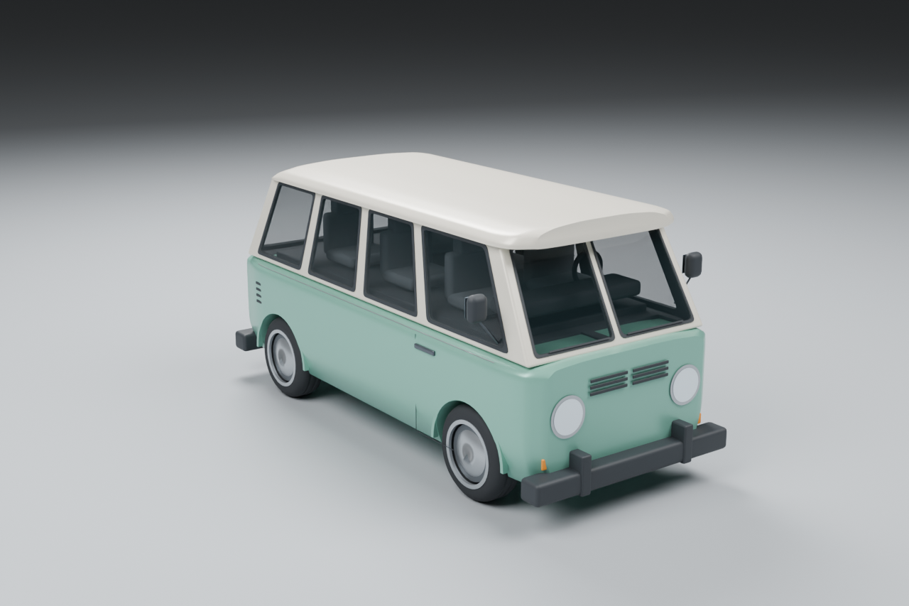

# 正式车模渲染与造型依据

这里是正式车模的造型依据。最初车型由在 从 Low Poly 三联原型中选定；
Sedan 与胶囊小车的更新依据分别见下文，不混用其他候选。

以下九张图片均直接渲染自本项目最终 Blender 模型；早期五张 AI 生成的造型参考已替换，历史选择可查 Git history。
车库菜单使用同一批 GLB 的可旋转实时预览，不读取这些静态图。`tools/garage_images.py` 生成的 WebP 副本也来自这些模型渲染。
正式模型保留轮廓、比例和主要结构，不照搬细碎表面装饰，不出现商标和车标。

全部九辆车的静态图可从仓库根目录重建；只更新部分车型时，在 Blender 命令末尾加 `-- --ids jeep`：

```sh
blender --background --python-exit-code 1 --python assets-src/vehicles/render_garage_references.py
python3 tools/garage_images.py
```

渲染只读取正式 GLB，不重新生成车模；拖挂按两个实际挂点连接，并轻微俯仰至车轮落地。每次渲染记录正式 GLB 和 PNG 的哈希；缩图工具先核对当前模型，再记录 WebP 哈希，游戏资产检查会拒绝模型已变而图片未更新的交付。

## Sedan

 中指定替换旧两厢车，采用 Model Y 的流线车身轮廓，游戏内只显示 Sedan。
造型依据 [官方尺寸与侧视图](https://www.tesla.com/ownersmanual/modely/en_us/GUID-1E76B638-7B12-4D9A-8767-94B7F1E92A0E.html)：
低圆润机盖、连续拱顶、四门侧窗、向后下降的尾部；不使用厂商模型、贴图、名称或商标。
 中指定黑色车身；车身与后视镜外壳使用同一黑色车漆，选车图从最终模型重新渲染。
内部资源编号仍是 `micro-hatch`，用来兼容既有赛道默认值和玩家存档。



## 胶囊小车 / City Pod

采用概念图四宫格的右上角 B。
超短白色蛋壳车身、椭圆车灯、白色封闭轮盘，青蓝灯圈围住圆形透明车门，门后是双座内饰。
深色前挡与车顶连成一体。它是新增车型，不替换 Sedan，也不使用参考照片里的商标。



## 跑车 C

低矮宽体双门跑车，长而有棱线的车头、短车尾。



## 轻型跑车

原创封闭车顶双门跑车。短轴窄车身、圆润短尾、两对独立圆角灯和湖蓝金属漆；没有高性能跑车的
大尾翼、飞扶壁和侧进气口，选车与驾驶画面都能从轮廓分开。没有厂牌、商标或可见驾驶员。



## 吉普 B

短轴双门硬顶，直立车厢、后挂备胎；不要照搬任何厂牌的格栅或车标。



## 皮卡拖挂房车 B

单排长货斗皮卡，以普通球头拖一节高而方正的单轴旅行房车；皮卡、连接间隙和整节房车都要读得清。



## 怪兽皮卡 / Monster Truck

原创现代改装表演车：保留完整皮卡驾驶室与独立货斗，巨型深胎纹轮胎下方是外露车桥、梯形车架、
长行程弹簧减震和连杆。炭黑车漆两侧使用原创橙红火焰和白色骷髅图案，无文字、厂牌或赞助标志。



## 校车 A

长车头、长车身的传统校车比例，正常在役外观，不做装甲和废土改装。



## 复古面包车 A

圆头、低顶、多侧窗、分体前挡风，海沫绿与暖白双色；不要照搬真实厂牌的前脸或比例。


