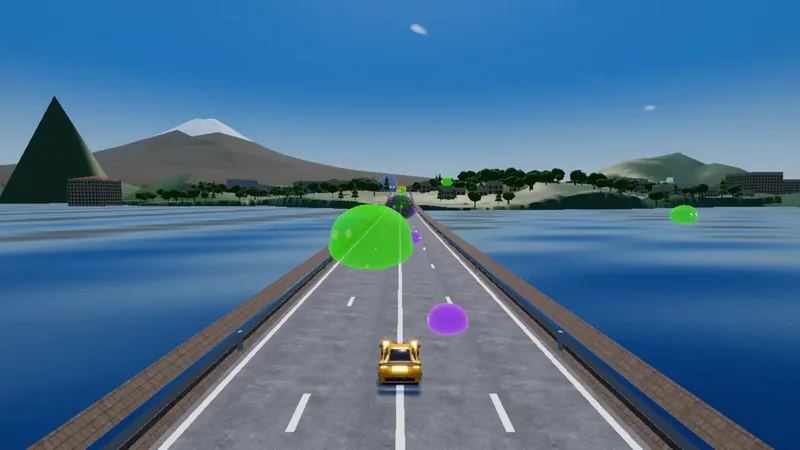

# Silicon Slime Rush: World Tour

[中文](#中文) · [Make your own game with the Remix Skill](../skills/remix/SKILL.md)

Thirteen destinations, thirteen real routes: drive through the Arc de Triomphe, towards the Potala Palace, around the Sydney Opera House and past the pyramids at Giza. Roads, terrain and buildings come from open map data, with modeled landmarks bringing each place to life.

This is a complete example remix, made from [original/](../original/) with the **[Remix Skill](../skills/remix/SKILL.md)**. It shares the original’s driving systems, AI rivals, weather, split-screen and touch controls, with different maps, landmarks, cars, interface theme and music.

<p>
  <a href="https://guigulaoshi.github.io/silicon-slime-rush/world-tour/"></a>
  <a href="https://guigulaoshi.itch.io/silicon-slime-rush-world-tour"></a>
</p>

Desktop, phone and tablet

Want your own setting, terrain and cars? Start with the **[Remix Skill](../skills/remix/SKILL.md)** and use this game as inspiration.

## Destinations

| Track | Destination |
|---|---|
| Tiananmen Square | Beijing |
| Lujiazui by Night | Shanghai |
| Potala Palace | Lhasa |
| Zhangjiajie Pillars | Zhangjiajie |
| Lake Kawaguchi & Fuji | Fujikawaguchiko |
| Burj Khalifa | Dubai |
| Sultanahmet | Istanbul |
| Colosseum | Rome |
| Arc to Eiffel | Paris |
| Pyramids of Giza | Cairo |
| Amboseli Savanna | Kenya |
| Lower Manhattan | New York |
| Over the Bridge, Round the Opera House | Sydney |

## Screenshots

<table>
  <tr>
    <td></td>
    <td></td>
    <td></td>
  </tr>
  <tr>
    <td align="center">Paris · 巴黎</td>
    <td align="center">Lhasa · 拉萨</td>
    <td align="center">Istanbul · 伊斯坦布尔</td>
  </tr>
  <tr>
    <td></td>
    <td></td>
    <td></td>
  </tr>
  <tr>
    <td align="center">Dubai · 迪拜</td>
    <td align="center">Sydney · 悉尼</td>
    <td align="center">Mount Fuji · 富士山</td>
  </tr>
</table>

## Layout

| Path | Contents |
|---|---|
| `game/` | Browser game: TypeScript, Three.js, Rapier physics and Vite |
| `pipeline/` | Python 3.12 map pipeline: OpenStreetMap and elevation data to streaming tiles; cached source data and route definitions |
| `assets-src/` | Blender Python sources for cars and landmarks; ready-to-use models are in `game/public/models/` |
| `tools/` | Map asset checks, size checks and release packaging |
| `docs/` | [Pipeline/runtime contract](docs/CONTRACT.md) and vehicle/landmark references |
| [ASSETS.md](ASSETS.md) | Asset sources, licenses and attribution |

## Run locally

From this game's directory (`world-tour/`):

```bash
cd pipeline
python3.12 -m venv .venv
.venv/bin/pip install -r requirements.txt
cd ../game
npm install
npm run dev
```

Open the local URL printed by Vite. Map tiles and textures are build products: `npm run dev`, `preview` and `build` ensure they are ready automatically. The first run builds every track; later runs rebuild only what changed. Ground textures may be downloaded from Poly Haven (CC0) on first use.

## Tests

Run each command from this game's directory:

```bash
(cd game && npm run typecheck && npm test)
(cd pipeline && .venv/bin/python -m pytest -q)
pipeline/.venv/bin/python -m pytest -q tools
(cd game && npx playwright install chromium && npm run e2e:quick)
```

## Package a release

From this game's directory:

```bash
python3 tools/release_package.py
```

This builds for the release URL, excludes synthetic test tracks, checks package size and release readiness, and creates a ZIP with `index.html` at its root. Follow the upload instructions printed by the tool.

## 中文

### 史莱姆赛车：环游世界

十三个目的地、十三条真实路线：穿过凯旋门、迎着布达拉宫、绕过悉尼歌剧院，从吉萨金字塔脚下开过去。道路、地形和建筑来自公开地图数据，地标模型让每座城市都有自己的样子。

这是用 [Remix Skill](../skills/remix/SKILL.md) 从原作做出的完整示范作品。沿用驾驶系统、AI 对手、昼夜天气、分屏和触屏操作，换了地图、地标、车辆、界面主题和音乐。

**[在线试玩](https://guigulaoshi.github.io/silicon-slime-rush/world-tour/)** · **[▶ itch.io 试玩](https://guigulaoshi.itch.io/silicon-slime-rush-world-tour)**。想做自己的城市、地形和赛车，直接从 [Remix Skill](../skills/remix/SKILL.md) 开始。

### 本地运行、测试与出包

在 `world-tour/` 目录按照上方英文部分的命令运行。先装地图管线的 Python 3.12 依赖，再进入 `game/` 安装依赖并启动。首次会构建赛道切片，并按需下载地面贴图；以后只重建有变化的部分。

上方测试命令分别检查类型与游戏逻辑、地图管线、工具脚本及浏览器运行。出包命令生成根目录带 `index.html` 的 ZIP，并打印上传说明。

目录说明：`game/` 是游戏，`pipeline/` 是地图管线，`assets-src/` 是车辆和地标源文件，`tools/` 是检查和打包脚本，`docs/` 是接口及参考资料。资源出处和许可见 [ASSETS.md](ASSETS.md)。

## Credits & license

Code: [MIT](../LICENSE). Map data © OpenStreetMap contributors (ODbL). Elevation: Mapzen/AWS Terrain Tiles. Other assets and attribution: [ASSETS.md](ASSETS.md).

代码采用 MIT 许可；地图数据采用 ODbL，高程来自 Mapzen/AWS Terrain Tiles，其他资源许可见资源清单。
